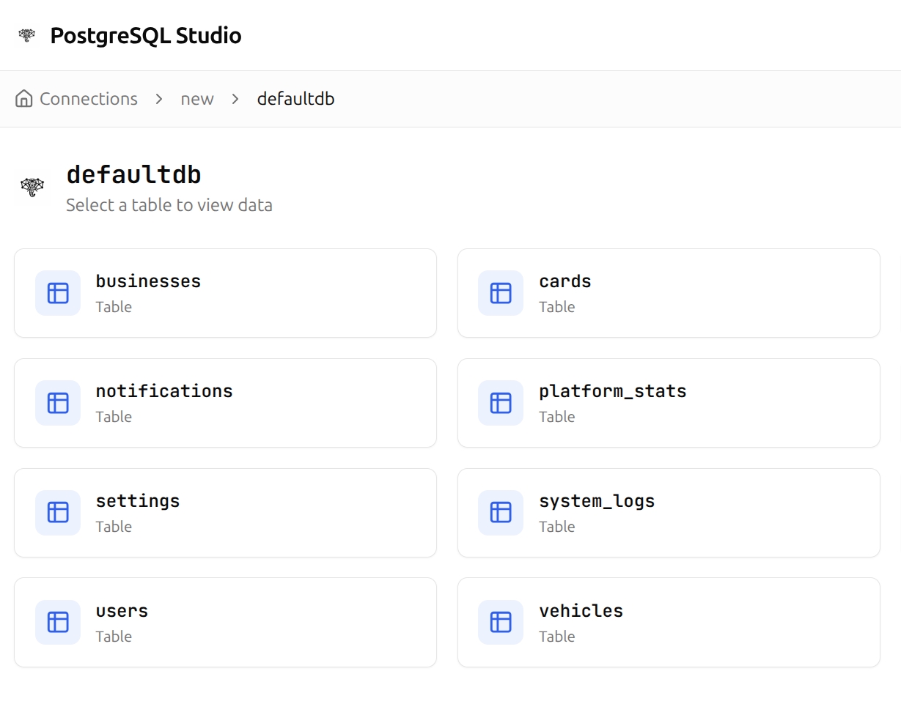

# Pg Studio

A modern, open-source web-based tool to explore, query, and manage PostgreSQL and MongoDB databases.
 

 
## Features
 
- **Multi-Database Support** - Connect to both PostgreSQL and MongoDB from one dashboard
- **Database Explorer** - Browse databases, tables/collections, and records with an intuitive interface
- **Data Preview** - Automatically preview data in tables or collections
- **Query Tools** - SQL editor for Postgres and JSON query builder for MongoDB
- **Schema Viewer** - View table schemas and collection details
- **Quick Actions** - Drop tables, collections, and databases with confirmation dialogs
- **Secure** - Connection strings are stored securely and never exposed to the client after creation
- **Breadcrumb Navigation** - Easy navigation between connections, databases, and resources

## Getting Started

### Installation

1. Clone the repository:

```bash
git clone https://github.com/ThembinkosiThemba/pg-studio.git
cd pg-studio
```

2. Install dependencies:

```bash
pnpm install
```

3. Create a `.env` file in the root directory:

```env
MONGODB_URI=mongodb://localhost:27017/postgres-studio
JWT_SECRET=your-secret-key-here
```

4. Run the development server:

```bash
pnpm dev
```

5. Open [http://localhost:3000](http://localhost:3000) in your browser.

## Usage

1. **Sign up** for an account
2. **Add a connection**, select **PostgreSQL** or **MongoDB**, and enter your connection string
3. **Select a connection** to view available databases
4. **Click a database** to see its tables
5. **Click a table** to preview data, view schema, or run queries

## Contributing

Contributions are welcome! Please feel free to submit a Pull Request.

## License

MIT License - feel free to use this project for personal or commercial purposes.
